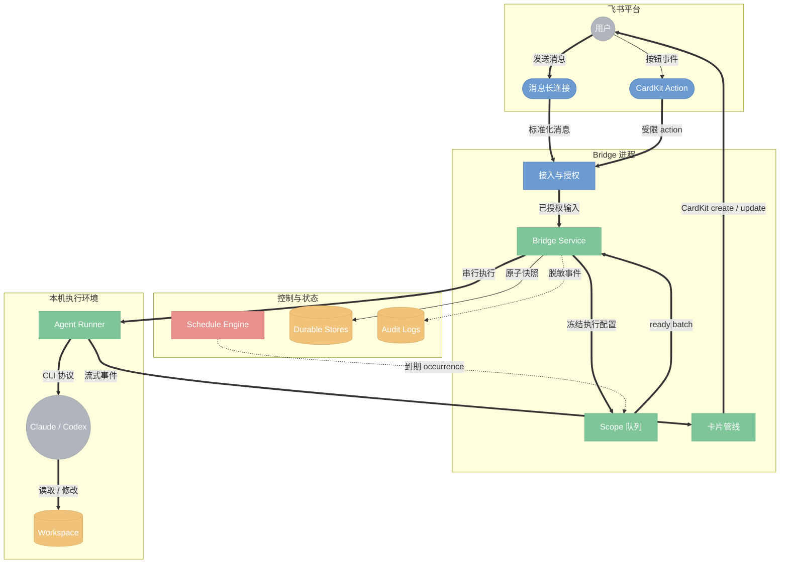
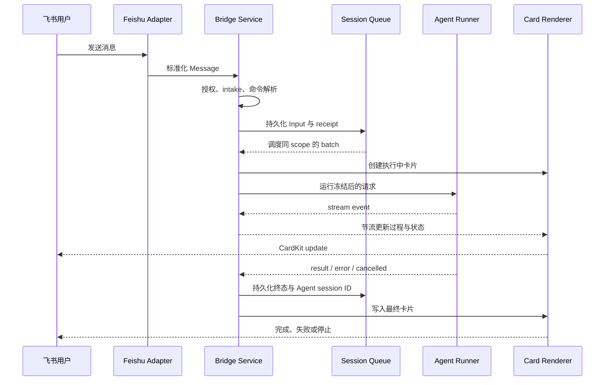

# Lark AI Agent Bridge 架构说明

## 文档目的

本文回答维护者接手项目时最先遇到的六个问题：系统解决什么问题、边界在哪里、消息如何流转、状态如何保持、失败如何收敛，以及新增能力应该落在哪一层。

Lark AI Agent Bridge 是一个运行在用户 workspace 旁边的单进程 Go 服务。它把飞书消息、CardKit action 和定时触发转换为 Claude Code 或 Codex CLI 的 one-shot 调用，再把增量过程和最终结果持续写回飞书。Bridge 负责接入、授权、会话、调度、持久化与呈现；Agent CLI 负责理解任务和操作 workspace。

## 系统边界

边界上最重要的判断是：Bridge 不是 Agent runtime，也不是远程终端。它不托管 tmux、PTY 或 WebTTY，不解释 Agent 的业务决策；每个 batch 都启动一次本机 CLI 子进程，并通过 CLI 的 session/resume 协议延续上下文。

## 架构原则

- **单一编排核心**：`internal/bridge.Service` 统一处理消息、命令、action、队列和执行生命周期，飞书 SDK 与 Agent CLI 都通过窄接口接入。
- **接收时冻结配置**：agent、bin、home、model、effort、workdir、reply mode 和 conversation mode 在 input 入队时固定。排队期间修改配置不会悄悄改变已有任务。
- **按 conversation scope 串行**：同一 scope 内保持顺序，不同 scope 可并行，不引入全局 FIFO 或全局并发锁。
- **先持久化，再产生外部副作用**：会话、schedule occurrence、action grant 和卡片 sequence 等关键状态先形成 durable 事实，再执行 Agent 或写飞书。
- **入口 fail-closed**：访问策略、配置 schema 或关键状态损坏时拒绝启动或拒绝请求，不以宽松默认绕过边界。
- **呈现与执行解耦**：Agent 输出先归一化为 `card.Event` / `card.Segment`，reply mode 再决定如何投影到 CardKit。

## 主执行链路

主链路分为五个阶段：

1. `internal/feishu` 将长连接事件标准化为 Bridge `Message`，原始事件可写入受限日志用于排障。
2. `Service.HandleMessage` 依次执行访问控制、群消息 intake、去重、命令解析、附件与引用消息解析。Topic 模式只在首轮 seed 解析并注入引用正文、发送者与附件，后续消息携带的 `parent_id=root` 不重复注入；chat 模式仍按每条显式引用解析。
3. 普通任务进入 `internal/session`。同 scope 输入可在 debounce 窗口内组成 batch；达到执行条件后由 dispatcher 启动 Agent runner。
4. `CLIExecRunner` 按 agent kind 构造 Claude 或 Codex 命令，逐行解析 JSONL，并把统一的 stream update 回调给 CardStream。
5. CardStream 创建、节流更新并收敛同一逻辑回复；终态先写 session，再写卡片。发送本地图片等终态副作用在 Agent 成功结果上继续执行，但单张图片失败不会把整个 run 改判失败。

## 核心组件

### 进程装配层

`cmd/lark-agent-bridge` 提供四类入口：

- `serve`：装配真实 Feishu adapter、durable stores、schedule engine、Agent runner 和后台循环。
- `doctor`：验证配置、凭据、wrapper、目录和部署前置条件。
- `simulate`：用 fake renderer 和可控 runner 验证消息到卡片的本地通道。
- `simulate-action`：不依赖真实按钮投递，直接验证 action 路径。

装配逻辑只负责构造依赖和生命周期，不承载消息业务规则。

### Bridge 编排层

`internal/bridge` 是系统核心，主要职责包括：

- 解析普通消息与 `/new`、`/stop`、`/compact`、`/config`、`/resume`、`/cd`、`/ws`、`/cron`、`/timer` 等命令。
- 计算 conversation scope、有效 workdir 和冻结后的 runtime preference。
- 驱动 session queue、debounce、batch、active run、stop 与 shutdown 收敛。
- 把 Claude/Codex 的不同事件协议归一为统一的卡片段和运行元数据。
- 桥接 action grant、schedule、升级、媒体、引用消息和通知能力。

`Service` 目前是有意保留的 application service：跨模块用例在这里编排，具体存储、平台协议和渲染细节则下沉到独立 package。新增能力应优先扩展窄接口或专用文件，避免把 SDK、JSON 持久化或 CardKit schema 细节重新塞回 `service.go`。

### 平台适配层

`internal/feishu` 隔离飞书特有协议：

- SDK 长连接负责消息、reaction、recall 和 `card.action.trigger`。
- sender 负责消息、图片、reaction、通知和消息读取。
- CardKit client 负责 create/update、token、限流与重试。
- renderer 把平台无关的 `card.Event` 转换为 CardKit 2.0 JSON。

生产按钮路径只使用长连接 `card.action.trigger`。可选 HTTP callback 是本地调试与 E2E 兼容入口，不是第二套生产控制面。

### Agent 适配层

`internal/agent` 和 `internal/bridge.CLIExecRunner` 封装 Agent 差异：

- Claude 使用 `-p --output-format stream-json`，通过 session ID resume；支持从已有 session fork 新 topic。
- Codex 使用 `exec --json` / `exec resume --json`，prompt 从 stdin 传入；当前 CLI 没有与 Claude 等价的 fork 能力。
- `/compact` 作为独立 durable control input 与普通 prompt 隔离：Claude 由 headless CLI 原生截获，Codex 通过同一 preset binary 的 app-server 执行 `thread/resume` 与 `thread/compact/start`，完成后继续沿用原 session ID。
- 两者都把正文、思考、工具、model、token 和 session ID 映射为统一结果。
- 子进程 `cmd.Dir` 与 `PWD` 都使用本轮冻结的有效 workdir；停止通过 context 取消并终止进程组。

具体流事件契约见 [agent-stream-message-contract.md](agent-stream-message-contract.md)。

### 卡片呈现层

`internal/card` 定义平台无关的事件、segment、meta、容量检查和 fake renderer；`internal/feishu` 实现 CardKit renderer。三种 reply mode 只改变事件投影，不改变执行语义：

- `Coder`：按时间顺序展示回复与工具进展。
- `Worker`：分区展示思考、正文与工具。
- `Singleton`：维持单张紧凑卡片更新。

所有模式最终都经过容量管线。平台硬限制、裁剪次序、自动续卡和 sequence 规则见 [cardkit-roadmap.md](cardkit-roadmap.md)。

## 会话、工作目录与并发

conversation mode 决定 session key：

- `chat`：key 为 `{Agent, ChatID}`，同一 chat 按 Agent 串行。
- `topic`：key 为 `{Agent, ChatID, ThreadID?}`；不同 topic 独立排队并可并行。主会话中显式 `@bot` 可生成 synthetic topic scope。

工作目录与会话上下文是两个不同概念：

1. 单条消息的 `--workdir` 是一次性最高优先级覆盖。
2. `/cd` 和 `/ws use` 写入 topic workspace store，它是后续消息的持久 workdir 权威。
3. 两者都没有命中时使用进程默认 workdir。

session 只记录本轮实际使用的 workdir，用于 catalog 和 `/resume` 归组，不反向决定下一轮目录。切换持久 workdir 会停止当前 run 并重置该 scope 的 Agent session，避免把旧上下文带进另一个代码目录。

同一 scope 始终只有一个 active batch。新输入进入 durable queue；`/stop` 只取消 active batch，不清空 queued input。不同 scope 没有全局 semaphore，因此能否并行主要受主机资源和外部 Agent 服务限制。

## 状态模型

默认状态目录为 `<workdir>/.lark-agent-bridge/`。关键 JSON store 使用 schema version 与临时文件原子替换，具体持久化实现由各 package 负责；不兼容的新 schema 或损坏文件通常会阻止 `serve` 启动。

| 状态 | 默认文件 | 负责内容 |
| --- | --- | --- |
| Session | `sessions.json` | scope、队列、batch、Agent session ID、receipt |
| Session catalog | `session-catalog.json` | `/resume` 可见的历史索引 |
| Workspace | `workspaces.json` | topic cwd 与命名 alias |
| Preference | `preferences.json` | 全局偏好与 per-chat override |
| Reply | `replies.json` | 逻辑回复到飞书卡片的 durable 引用 |
| Card sequence | `native-sequence-journal.json` | CardKit update 单调 sequence |
| Access | `access.json` | owner/admin、用户、群和成员策略 |
| Action grant | `action-grants.json` | 一次性 action capability 与防重放状态 |
| Schedule | `schedules.json` | draft、task、occurrence、run 与 receipt |
| Intake | `participated-topics.json`、`topic-aliases.json` | 已参与话题和 topic 映射 |
| Runtime flags | `dev-mode.json` | 按用户保存的开发者模式 |

`agents.json` 是人工维护的 Agent catalog，不属于运行时写入状态。凭据只从环境变量进入内存，不写入上述文件。

进程重启只恢复 durable context，不重放不确定的旧工作：恢复时 `debouncing`、`queued`、`starting` 输入转为 `cancelled`，`running` 输入转为 `interrupted`；新消息从空闲队列继续。schedule 使用 durable occurrence 与 receipt 做补偿，语义见下节。

## 受控旁路

### Card action

敏感按钮在渲染时签发随机、不透明、持久化的 `ActionGrant`，绑定 actor、chat、session、action、value digest、过期时间和 access policy revision。回调必须在任何副作用前校验并原子消费 grant；跨 actor、跨 scope、参数篡改、过期、策略变化和重复点击都会被拒绝。

action transport 只负责解析与 ACK/toast。实际状态变化回到 `ActionGateway -> Service`，终态卡仍通过 CardKit update 写入，避免形成独立于消息路径的第二套业务逻辑。

### Schedule

Agent 只能通过私有 Unix socket 和单次 token 提交规则字段，不能指定用户、chat/topic 或执行配置。Bridge 创建 draft，用户确认后才形成 enabled task。到期 occurrence 先持久化，再以确定性 synthetic message ID 进入现有 session queue，因此复用队列上限、去重、CardKit 和 stop 语义。

调度采用 at-least-once claim 与 durable receipt reconciliation：重启只补偿窗口内最近一次 occurrence；同一 task 不重叠；无法确认结果是否送达时记录 `delivery_unknown`，不伪报成功。

### Media 与本地图片

入站图片和文件先经过类型、大小与批次策略，再下载到内容寻址 cache；Agent 只看到当前 workdir 内解析后的安全路径。出站图片只接受 Agent 最终回答显式引用、位于当前 workdir 内且格式与大小合规的本地文件。Bridge 不扫描目录，也不下载公网图片代发。

## 安全与可靠性边界

- **访问控制**：私聊只允许 owner、admin 和 allowlist 用户；群聊先校验群，再按成员策略判断 sender。owner 定期刷新，刷新失败保留最近一次可信值。
- **群消息 intake**：`mention_only`、`participated_topics`、`all_group_messages` 是独立于访问控制的第二道门；默认只处理明确提及 bot 的消息。
- **凭据**：App secret、Agent credential 和 schedule token 不进入配置快照、Agent prompt 或审计正文。
- **日志**：`audit.jsonl` 记录脱敏事件；`agent-requests.jsonl` 为受限精确 prompt 日志；`feishu-events.jsonl` 保存 SDK 解析前事件。三者用途和敏感度不同。
- **去重**：消息 receipt、schedule run ID、action grant 和 CardKit sequence 分别约束不同的重复投递，不用一个通用 ID 假装覆盖全部一致性问题。
- **关闭**：收到 SIGTERM/SIGINT 后停止接收新输入，关闭 schedule control，取消 active Agent，等待有界 grace period，并保存可恢复 context。
- **自升级**：只有 owner/admin 可确认；升级前检查 active/queued 任务、manifest、文件大小与 SHA-256，原子替换失败时恢复旧 binary。新 binary 成功启动后，systemd 托管进程以专用非零退出码触发 supervisor 重启，避免新子进程被 `KillMode=control-group` 清理后 unit 停留在 inactive。

## 配置与部署

`serve` 是单进程部署单元，依赖本机 workspace、Agent CLI 和飞书 App 凭据。启动顺序是：加载并校验配置，打开所有 durable stores，恢复 session，装配 Feishu/Agent/CardKit adapter，启动 schedule control 与 engine，最后进入长连接循环。任一关键 store 或身份前置失败都会在接收消息前退出。

当前运行时仍以 `internal/config.Config` 完成主装配；`internal/persist` 是配置持久化收敛中的基础设施，尚未替代全部旧配置入口。维护文档必须区分“已接入生产主链路”和“已存在但仍在迁移的 package”，不能仅凭目录存在就宣称架构切换完成。

部署、环境变量和升级操作见 [README](../../README.md) 与 [AI Agent 安装工作流](../workflow/ai-agent-install.md)。

## 扩展路径

新增能力时先判断它属于哪条边界：

- 新飞书事件或发送能力：扩展 `internal/feishu` adapter，再向 `Service` 暴露最小接口。
- 新 Agent backend：实现命令构造与流事件归一化，不让 CardKit 层识别 backend 私有事件。
- 新命令：在 `internal/bridge` 增加解析、权限和 use case；需要持久状态时建立独立 store。
- 新回复布局：扩展 `internal/card` 的事件投影与 renderer，保持 session/runner 不变。
- 新异步触发器：像 schedule 一样先持久化确定性输入，再投递既有 session queue。
- 新敏感 action：必须使用 `ActionGrant`，并在副作用前完成 actor、scope、policy revision 和重放校验。

避免三类捷径：绕过 `Service` 直接从 SDK 回调启动 Agent；绕过容量管线直接拼 CardKit JSON；只更新内存状态却不定义重启后的语义。

## 验证与相关文档

架构边界对应四层验证：纯逻辑用 Go 单测，消息到卡片的组件链用 `simulate`/fake agent，真实飞书协议用确定性 E2E，真 Agent 只保留必要 canary。完整分层、命令和证据格式见 [测试框架](../workflow/test-framework.md) 与 [Testing Workflow](../workflow/testing.md)。

专题文档：

- [Agent 流消息展示契约](agent-stream-message-contract.md)
- [CardKit 能力与演进路线](cardkit-roadmap.md)
- [E2E 覆盖矩阵](../workflow/e2e-coverage-matrix.md)
- [真实飞书 E2E](../workflow/e2e-real.md)

## 明确不做

- 不提供 tmux、PTY、WebTTY 或共享终端输入仲裁。
- 不提供全局 FIFO、公平调度或企业级多租户资源治理。
- 不把飞书历史消息当作 Agent 会话数据库；上下文延续以 Agent session 协议和 Bridge catalog 为准。
- 暂不以 SQLite 替换 JSON stores；只有查询、事务或规模需求明确超过当前模型时再评估。
