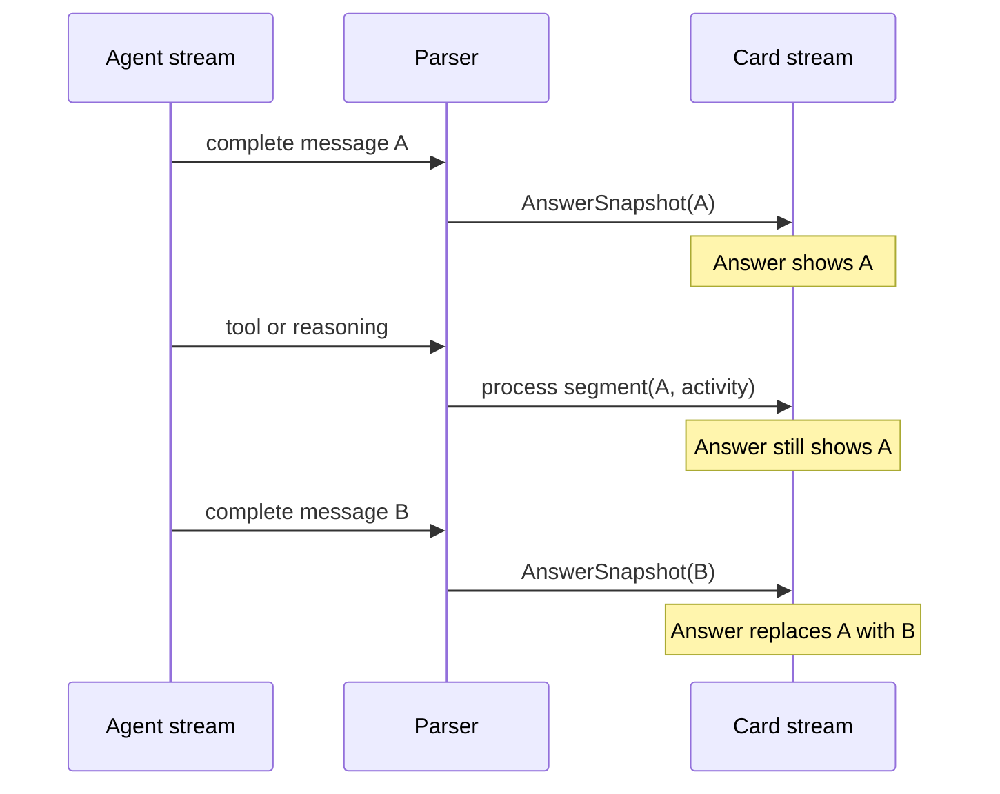

# Latest Answer Continuity

## Goal

For `append-clean-card` and `latest-card`, the answer section always displays
the most recent complete assistant message while an agent is running. Tool,
reasoning, and other progress events can add material to the process section,
but cannot clear the answer section. The next complete assistant message
replaces the answer section.

`append` keeps its existing inline-history semantics.

## Event Contract

`ProgressSnapshot` retains its meaning as a process record, but no longer
resets the answer builder for clean-card reply modes. A complete assistant
message is the only streaming event that replaces that builder.

## Parser Changes

### Claude

Keep emitting the current full assistant-message `AnswerSnapshot` and later
`ProgressSnapshot` records. The card-stream change makes the prior snapshot
remain visible while the follow-up tool or reasoning events run.

### Codex

Codex `agent_message` records do not contain a final/commentary phase. Treat
every completed record as the newest visible answer candidate immediately:

1. Emit `SegmentText` with `AnswerSnapshot=true` when the record arrives.
2. Keep it pending until the next protocol boundary.
3. If later activity proves it is not terminal, append the same text as a
   `SegmentThought` process record with `ProgressSnapshot=true` and
   `AssistantSnapshot=false`. This counts one process round without triggering
   ordered-answer replacement.
4. On `turn.completed`, store the remaining candidate as the terminal answer.

The resulting `AgentRunResult` continues to classify all non-final Codex
messages as process segments and only the final candidate as an answer
segment. This preserves terminal output and historical process content while
changing only the running-card experience.

## Error Handling

A failed turn demotes an already-shown candidate to process history but leaves
the last answer visible in the error card. The existing clean-exit fallback for
a missing terminal event remains valid: it promotes the pending candidate into
the terminal result, without changing the visible answer text.

## Validation

- A Claude text message followed by a tool keeps the text in the answer area
  and records process activity separately.
- A Codex message followed by a tool emits an immediate answer snapshot, then
  records the message as process history without clearing the answer.
- A second Codex message replaces the first answer snapshot.
- Terminal, failed, and clean-exit-without-terminal paths retain the correct
  final `AgentRunResult` classification.
- L1 runs the full Go test suite; L2 injects a controlled Codex JSONL stream
  through the card path; L3 verifies a real Codex card on the ephemeral Test
  bot, including its visible answer section during tool execution.
