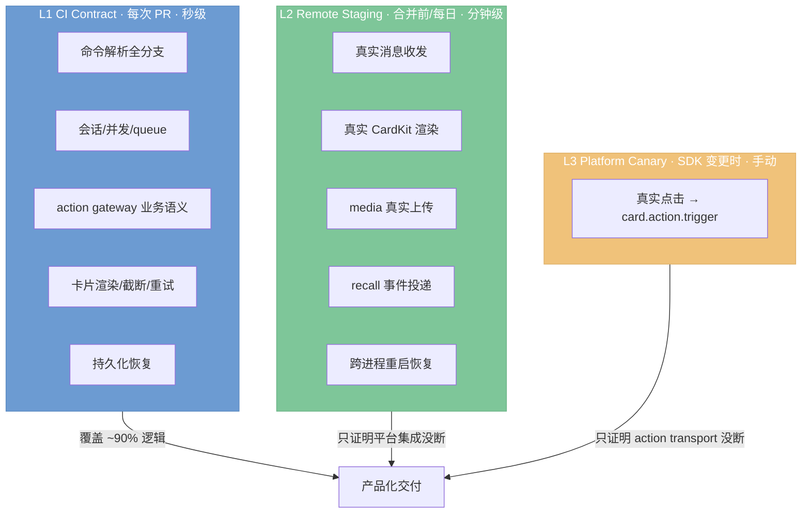

# E2E 覆盖矩阵与分层测试策略

面向产品化交付,本文回答三件事:**完整 e2e 应覆盖哪些用例、每个用例当前落在哪一层、哪些是真缺口。** 操作手册见 `testing.md` 与 `e2e-real.md`,本文只负责「覆盖地图」。

## 分层策略(决定回归速度的核心)

回归慢的本质原因不是 case 太多,而是把本该在 L1 用 fake SDK 秒级验证的业务逻辑,压在了真实飞书往返上跑。产品化后按三层拆分:

**决定性差异:** L1 承担完备性与回归速度(依赖 fake SDK + fake Claude,可并发、无网络);L2 只验证「真实飞书平台集成没断」;L3 只验证「真实用户点击到 bridge 的 action transport 没断」。

`internal/feishu` 已提供完整 interface 抽象(`CardKitClientAPI`、`LongConnClient`、`Sender`、`ReplyAPI`、`HTTPDoer` 等),L1 补测直接复用现有 mock 模式,无需新建测试脚手架。

## 覆盖矩阵

图例:✅ 已覆盖 · ⚠️ 部分 · ❌ 真缺口 · 层级指该能力**主要**在哪层验证。

### 域 1 · 命令解析
| 用例 | 层 | 状态 | 证据 |
|---|:---:|:---:|---|
| `/new` 基本 + Reset/Explicit | L1 | ✅ | `TestParseNewCommand` |
| `/new --workdir` | L1 | ✅ | `TestParseNewCommand` / `TestTargetWorkDirUsesRunOption` |
| `/new --cwd` 别名 | L1 | ✅ | `TestParseNewCwdAliasMatchesWorkdir`(新增) |
| `--workdir` 缺参降级 | L1 | ✅ | `TestParseNewWorkdirMissingValueIsTreatedAsLiteralText`(新增) |
| `/status` 解析 | L1 | ✅ | `TestParseStatusCommand`(新增) |
| `/help` 解析 | L1 | ✅ | `TestParseHelpCommand`(新增) |
| `/resume` 降级文案 | L1 | ✅ | `TestParseResumeReturnsNotImplementedDegradation`(新增) |
| 未知命令文案 | L1 | ✅ | `TestParseUnknownCommandReturnsFormattedMessage`(新增) |
| 纯文本续接 scope | L1 | ✅ | `TestParsePlainText*` |
| 群未 @ 过滤 | L1 | ✅ | `TestParseCommandIgnoresGroupWithoutMention` |

### 域 2 · 会话生命周期与并发
| 用例 | 层 | 状态 | 证据 |
|---|:---:|:---:|---|
| restart 保留上下文/取消 queued/中断 running | L1 | ✅ | `store_test.go` 一组 `TestRestore*` |
| debounce(DM/群) | L1 | ✅ | `TestServiceBatchesPlain{DM,Group}InputsWithinDebounceCohort` |
| busy 合并输入 | L1 | ✅ | `TestServiceMergesBusyTopicInputsIntoNextBatch` |
| queue 满拒绝 | L1 | ✅ | `TestServiceRejectsTwentyFirstPendingInput` / `TestEnqueueDurableRejectsFullQueue` |
| 多 topic 并行隔离 | L1 | ✅ | `TestDifferentTopicsRunInParallel` |
| 同 ID 并发去重恰好一次 | L1 | ✅ | `TestAcceptMessageConcurrentSameIDAcceptsExactlyOnce` |

### 域 3 · Action 与 Stop
| 用例 | 层 | 状态 | 证据 |
|---|:---:|:---:|---|
| stop 终止当前 batch | L1 | ✅ | `TestServiceStopCancelsActiveOneShotRun` |
| stop 保留后续 queue | L1 | ✅ | `TestServiceStopKeepsLaterQueue` |
| 重复 stop 幂等 | L1 | ✅ | `TestServiceStopIsIdempotentForAlreadyStoppedRun`(新增) |
| stop 未知/过期 batch 降级 | L1 | ✅ | `TestServiceStopUnknownSessionDegradesToStoppedCard`(新增) |
| action 同步卡关闭 streaming_mode | L1 | ✅ | `TestServiceStopSyncCardDisablesStreamingMode`(新增) |
| create_workdir / cancel_workdir | L1 | ✅ | `TestServiceMissingWorkdirAsksThenRunsAfterCreate` / `TestWorkdirCancelDoesNotRun` |
| config.save 往返 | L1 | ✅ | `TestServiceConfigSavePersistsValidValuesAndRejectsInvalidValues` |
| 真实 `card.action.trigger` 投递 | **L3** | ❌ | 需真实点击,见下「L3 canary」 |

### 域 4 · 流式卡片与 native streaming
| 用例 | 层 | 状态 | 证据 |
|---|:---:|:---:|---|
| text delta 渲染 | L1 | ✅ | `TestStreamUpdateParsesClaudeDeltaThinking` 等 |
| thinking delta 渲染 | L1 | ✅ | `TestStreamUpdateParsesClaudeDeltaThinking` |
| content_block 级 thinking/redacted | L1 | ✅ | `TestStreamUpdateParsesContentBlockLevelThinking`(新增) |
| tool_use 解析 | L1 | ✅ | `TestStreamUpdateParsesToolUseBlockIntoToolSegment`(新增) |
| tool_result 解析 | L1 | ✅ | `TestStreamUpdateParsesToolResultBlockIntoToolSegment`(新增) |
| CardMaxChars 截断 | L1 | ✅ | `TestLimitEventTruncatesTextFields` / capacity_test 一组 |
| 本地容量拒绝 → emergency 重试 | L1 | ✅ | `TestCardKitRendererRetriesLocalCapacityRejection...` |
| **服务端 429/5xx 自动重试** | L1 | ✅ | `TestCardKitClientRetriesRateLimitedRequestThenSucceeds` / `...DoesNotRetryNonRetryable`(新增) |
| sequence 乱序 / sequence_unknown | L1 | ✅ | `native_sequence_journal_test.go` 一组 + `TestServiceRecoverySkipsSequenceUnknownCardOnce` |
| 真实 CardKit 渲染兼容性 | **L2** | ✅ | `native_text_stream`(e2e-real) |

### 域 5 · Reply 模式
| 用例 | 层 | 状态 | 证据 |
|---|:---:|:---:|---|
| append / clean / latest 三模式 | L1+L2 | ✅ | reply `policy_test.go` + e2e `reply_*` |
| latest 重启回退 stale card | L1+L2 | ✅ | `latest_restart_fallback` |

### 域 6 · Media
| 用例 | 层 | 状态 | 证据 |
|---|:---:|:---:|---|
| 附件/图片/文本文件/部分成功/拒绝 | L2 | ✅ | e2e `media_*` 五个 case |
| forged MIME / oversize / 未知二进制拒绝 | L1+L2 | ✅ | `media` 包单测 + `media_rejected` |

### 域 7 · 撤回与 reaction
| 用例 | 层 | 状态 | 证据 |
|---|:---:|:---:|---|
| 撤回状态/pending workdir/queued input | L1+L2 | ✅ | `TestMessageRecall*` + e2e `message_revoke*` |
| reaction 生命周期 | L1+L2 | ✅ | `reaction_lifecycle_test.go` + e2e `reaction_lifecycle` |
| recall **事件投递**(非删除 API) | **L2** | ✅ | e2e `recall_state`;删除 API 成功 ≠ 事件已投递 |

### 域 8 · 配置与模型
| 用例 | 层 | 状态 | 证据 |
|---|:---:|:---:|---|
| config 往返/reset/frozen queue | L1+L2 | ✅ | `TestServiceConfig*` + e2e `config_*` |
| 非法 model/effort/mode 拒绝 | L1 | ✅ | `config_test.go` 一组 `RejectsInvalid*` |
| requested vs actual model | L1+L2 | ✅ | `TestServiceSeparatesRequestedAndActualModel` + `requested_actual_model` |

### 域 9 · 持久化与恢复(覆盖最完整,非缺口)
| 用例 | 层 | 状态 | 证据 |
|---|:---:|:---:|---|
| session 跨重启恢复 + 去重 | L1 | ✅ | `TestAcceptAndEnqueuePersistsReceiptAtomicallyAndRejectsAfterRestart` |
| snapshot 损坏/未知版本降级 | L1 | ✅ | `TestLoadSnapshotRejectsMalformedData` / `RejectsUnknownVersion` |
| 持久化失败不发布脏状态 | L1 | ✅ | `store_test.go` 一组 rollback 测试 |
| preference / reply store 全生命周期 | L1 | ✅ | `preferences_test.go` / `reply/store_test.go` |
| ProcessRecoveryNotices 渲染侧 | L1 | ✅ | `service_test.go` 8 个 `TestServiceRecovery*` |
| 真实跨进程重启恢复 | **L2** | ✅ | e2e `session_restart_context` / `restart_*` |

### 域 10 · 安全与鉴权(**已知缺口,本轮不处理**)
| 用例 | 层 | 状态 | 说明 |
|---|:---:|:---:|---|
| 用户鉴权 / owner-invite 体系 | — | ❌ | `internal/security` 当前近乎空;当前无鉴权 + `--dangerously-skip-permissions`,任何 @bot 者可触发本机命令执行 |
| callback endpoint 未授权访问 | — | ❌ | 依赖上面的鉴权体系 |
| workdir 路径穿越 | — | ❌ | 依赖鉴权体系 |

> **域 10 是功能缺口,不只是测试缺口——需先有访问控制实现,才能补测。** 参考 lcab `policy/access.ts` 的 owner/invite 体系。本轮按决策仅登记为已知风险,留待专门迭代。

## L3 Platform Action Canary(独立、低频、手动)

真实 `card.action.trigger` 长连接投递无法用服务端 API 等价模拟(需真实用户点击卡片)。建议:

- 在一台已登录飞书的专用 macOS runner 上,用 UI automation 找到测试卡片点击 Stop。
- 远端 audit 断言:收到真实 actor、出现 `batch_stop_requested`、终态 `stopped`、按钮 disabled、stop 后无新增 native preview。
- **不进 PR 门禁**——UI automation 脆弱,受客户端版本/窗口/折叠影响。仅在 SDK 升级或飞书事件配置变更后手动跑一次。此链路由官方 SDK 的 `ws.Client` + `OnP2CardActionTrigger` 承载,属 SDK 契约,极少 regress。

## 回归提速现状与剩余重构

### 已完成(纯本地可验证)
- **readiness 探针轮询 1s → 0.3s**(`e2e-real.sh` startup 循环):server 通常亚秒级就绪,回收大部分启动等待,不增加风险。
- **readiness 从 callback challenge 解耦**:`start_server_if_needed` 只匹配本次启动后新增的 `connected to wss`;callback challenge 保留为 gateway 注入 action 的额外探针。真实飞书 `new_basic` 已确认 readiness 约 2 秒内完成并继续产生 CardKit `event=result`。

### 剩余重构(需真实 e2e 环境验证,建议在有环境时执行)
这些改动改的是 bash 编排层,改完只能在真实飞书环境端到端验证,不宜盲改:

1. **消除 native_text_stream 中途重启**:该 case 需要 `E2E_CARD_UPDATE_MS=50` 高频更新,当前靠「切参数 → 重启 server」注入。因为该参数对其他 case 无害,可考虑常开该参数、去掉切换重启;但 `--case` 允许任意顺序,切回分支(`e2e-real.sh:2416`)在乱序执行时**不是死代码**,不能简单删除。安全做法:仅在检测到「下一个 case 需要不同参数」时才重启,而非每次切换都重启。
2. **失败 recovery 从「重启进程」改为「软重置会话」**:当前失败 case 后 `stop_server` + `start_server`(`e2e-real.sh:2434-2446`)。改为新建 topic/chat 隔离,不重启 server。
3. **隔离性 case 按 chat/topic 分组并发**:`scope_parallel` 已证明不同 topic 互不干扰,DM/不同 topic/不同 chat 的 case 可并发投递。

### 最大杠杆(阶段 3)
真实列表已从 38 个收敛到 9 个。保留集合为 `new_basic`、`streaming_card`、`session_restart_context`、`recall_state`、`media_attachment_only`、`media_images`、`media_text_files`、`latest_restart_fallback`、`native_text_stream`。

迁到 L1 门禁的 29 个原 case 按能力分组如下:

- 本地环境:`preflight`、`wrapper_preflight` → `e2e-preflight.sh`、doctor tests。
- 命令与 scope:`help`、`status`、`workdir_existing`、`topic_reply_at`、`topic_reply_without_at_negative` → parser/service tests。
- recall 业务语义:`message_revoke`、`message_revoke_pending_workdir`、`message_revoke_queued_input` → `TestMessageRecall*`;L2 只保留事件投递 `recall_state`。
- restart 状态语义:`restart_queued_cancel`、`restart_running_interrupted` → store restore/service recovery tests;L2 只保留两个跨进程代表场景。
- 并发与 queue:`debounce_dm`、`debounce_group`、`busy_merge`、`queue_full`、`scope_parallel`、`stop_preserves_queue` → session/service tests。
- media 业务校验:`media_partial`、`media_rejected` → media/service tests;L2 只保留三类真实上传与下载。
- config/model:`config_roundtrip`、`config_reset`、`config_frozen_queue`、`requested_actual_model` → config/service tests。
- reply:`reply_append`、`reply_clean`、`reply_latest` → reply policy tests。
- preview/reaction:`preview_thresholds`、`reaction_lifecycle` → stream preview/reaction tests。

决定性边界是:L1 证明业务语义,L2 只证明飞书 transport、CardKit、media、recall subscription 与跨进程集成没有断。

## 已知 flaky
- `internal/doctor · TestClaudeWrapperPreflightUsesBoundedHarmlessInvocation`:全量并行跑时偶发 "timed out"(资源竞争),单独重跑稳定通过。属时间敏感测试,与业务逻辑无关。
