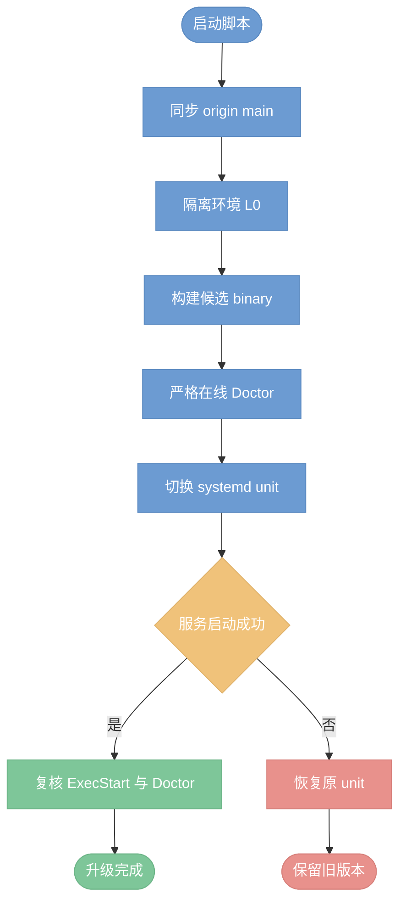

# 本机源码升级 Bridge

`scripts/upgrade-local-bridge.sh` 将本机 systemd user service 更新到仓库远端分支的最新提交。它适用于维护者直接从可信源码构建开发版，而非面向普通用户的 manifest 自升级。



## 默认实例

在仓库根目录执行：

```bash
./scripts/upgrade-local-bridge.sh
```

默认目标是当前维护环境的 `lark-ai-agent-bridge-dada.service`、`/root/ws/dada-workspace` 与 `origin/main`。脚本会从 `~/.config/lark-ai-agent-bridge/dada.env` 读取运行配置，但不会打印其中的凭据。

先检查参数解析且不改变任何状态：

```bash
./scripts/upgrade-local-bridge.sh --dry-run
```

## 多实例

每个实例都必须显式指定 service、workspace 与环境文件。升级脚本只替换该 unit 的唯一 `ExecStart`，不影响其它 Bridge 实例：

```bash
./scripts/upgrade-local-bridge.sh \
  --service lark-ai-agent-bridge-example.service \
  --workdir /srv/example-workspace \
  --env-file ~/.config/lark-ai-agent-bridge/example.env
```

可用 `--branch release-candidate` 从受信任的其它远端分支构建。该分支必须能通过 fast-forward 同步；脚本拒绝脏工作树、合并提交需求和无法匹配的远端 HEAD。

## 安全与失败语义

- 升级会重启目标 systemd service，正在运行的 Agent 子进程会被停止；应在无关键运行任务时执行。
- L0 在清理 live store、reply mode 与凭据变量的子进程中运行，且使用 `umask 022`，避免 supervisor 环境干扰测试夹具。
- 候选 binary 先运行 `doctor --strict --online`，验证 wrapper、workspace 与飞书 Bot 身份；失败时不修改 service unit。
- 切换后会复核 service 的 `ExecStart` 与在线 Doctor。启动失败或 binary 不匹配时，会恢复本次执行前的 unit 文件并重启旧服务。
- 每次切换前都会保存一个同目录 `*.before-<commit>` unit 备份，方便人工审计；binary 版本目录也保留，便于回退。
