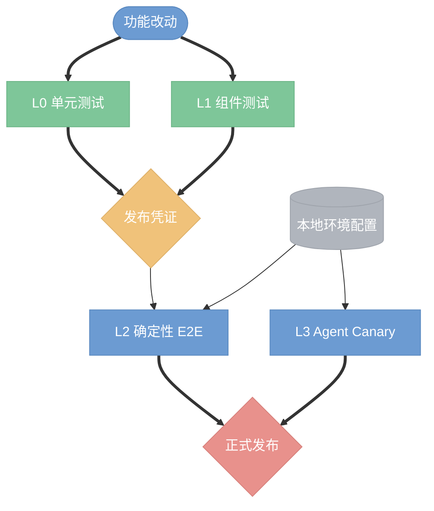

# Bridge 测试框架

本文说明 Bridge 的 L0-L3 测试边界、公开运行入口与发布门禁。真实飞书 E2E
的准备步骤见 [testing.md](testing.md)，用例矩阵见
[e2e-coverage-matrix.md](e2e-coverage-matrix.md)，正式发布回归见
[regression.md](regression.md)。

## 分层原则

- **L0 · 单元测试**：纯逻辑、状态机、协议解析和渲染契约，无网络依赖。
- **L1 · 组件测试**：`simulate`、`simulate-action` 与 fake agent，覆盖跨模块行为。
- **L2 · 确定性 E2E**：真实飞书链路配合 fake agent，验证 CardKit、audit 和重启行为。
- **L3 · 真 agent canary**：真实飞书链路配合 Claude/Codex，验证认证、指令遵从和 session 续接。



改动从最低成本层开始验证，逐层覆盖到风险边界。纯逻辑变更通常止于 L0；涉及
CLI、session 或卡片数据模型时至少跑 L1；涉及飞书 SDK 时序、真实回调或网络链路
时跑 L2；只有认证、模型行为或 instruction 遵从必须使用真实 Agent 时才跑 L3。

## 本地门禁

```bash
GOCACHE=$PWD/.cache/go-build go test ./...
GOCACHE=$PWD/.cache/go-build go run ./cmd/lark-bridge-test --smoke
./scripts/verify.sh
```

`go test ./...` 同时运行 `internal/testfw` 挂载的 smoke suite。需要快速迭代时可用
`go test -short ./...` 跳过 smoke integration。测试命令应清理或覆盖
`E2E_PREFERENCE_STORE`、`E2E_REPLY_STORE`、`E2E_MEDIA_CACHE_DIR` 和
`E2E_SESSION_STORE`，防止读取本机运行态数据。

## L1 组件测试

L1 runner 位于 `internal/testfw`，测试用例位于 `tests/smoke/` 和
`tests/regression/`。步骤使用 `input` 触发 `simulate`，或使用 `action` 触发
`simulate-action`。fake agent fixture 位于 `scripts/e2e/fixtures/`，L1 与 L2 共用
同一契约。

```bash
GOCACHE=$PWD/.cache/go-build go run ./cmd/lark-bridge-test --smoke
GOCACHE=$PWD/.cache/go-build go run ./cmd/lark-bridge-test --regression
GOCACHE=$PWD/.cache/go-build go run ./cmd/lark-bridge-test \
  --tags config,session --report-json /tmp/bridge-test-report.json
```

新增用例时优先复用已有断言。顺序语义使用 `segments_order`；单点可见内容使用
`segment_contains` 或 `any_segment_contains`；真实 UI 渲染和飞书 action 投递不能用
L1 结果替代。

## L2 与 L3

环境声明位于 `docs/environments/<name>.env`，只绑定通用角色、路径和 profile
名称。真实 App ID、机器路径和 profile 名称属于本地配置，不得提交。请从
[profile.example.env](../environments/profile.example.env) 创建被忽略的
`local.env`，密钥及用户、群组标识只放入权限为 `0600` 的本地 profile。

```bash
# L2：真实飞书 + fake agent
make test-l2 ENV=local

# L3：真实飞书 + 真 agent canary
make test-l3 ENV=local

# 正式版完整回归
make test-release ENV=local
```

L2/L3 会建立真实网络连接并可能发送测试消息，必须使用隔离的测试应用和测试群。
同一 App 的长连接应由单一运行实例持有；运行前通过 preflight 确认权限、bot 身份、
测试群可见性和 runtime 独占条件。

## 发布门禁

`cmd/lark-bridge-release test-evidence ensure` 生成绑定 commit、tree、Go 环境与测试
sidecar 的发布凭证。`publish.sh` 要求 L0/L1 凭证有效；正式版还应通过
`scripts/release-regression.sh` 的 L2 确定性 E2E 和 L3 canary。

新增测试时遵循以下约束：

1. 先搜索是否已有等价覆盖，避免重复用例。
2. 能在 L0/L1 证明的行为不提升到真实网络层。
3. L2/L3 case 必须声明 capability 和明确的外部前置条件。
4. 真 Agent 输出只断言关键行为特征，不锁定自然语言细节。
5. 完成后至少运行 `go test ./...` 与 `./scripts/verify.sh`。

相关入口包括 `scripts/e2e-real.sh`、`scripts/e2e/run.sh`、
`scripts/release-regression.sh`、`cmd/lark-bridge-test` 与 `internal/testfw`。
