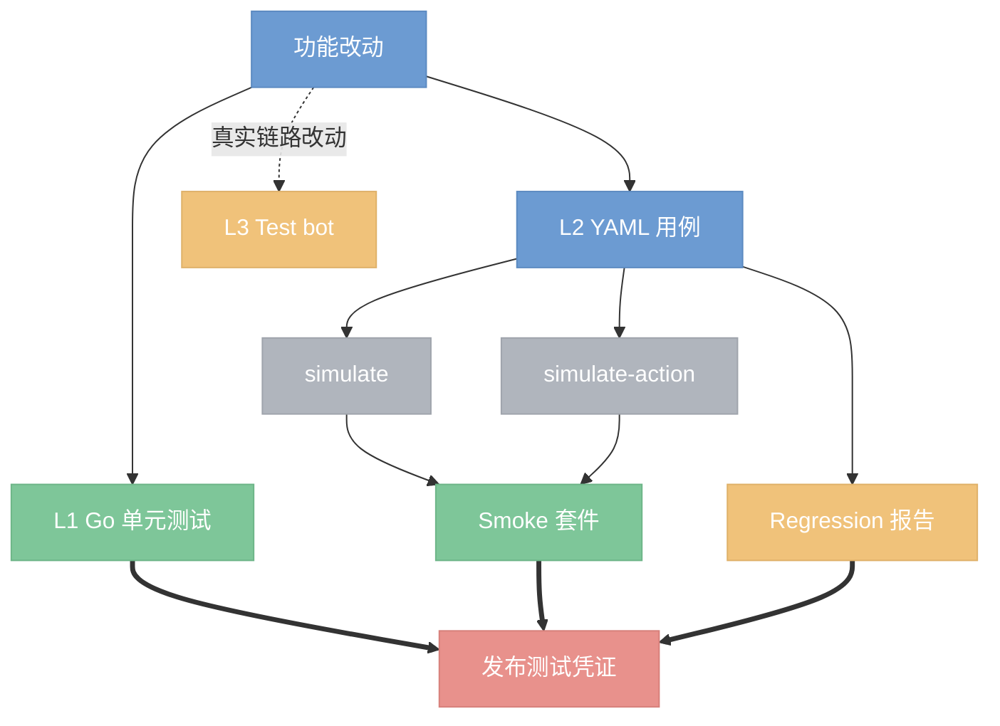

# Bridge 测试框架

本文说明当前 bridge 的 YAML 测试框架如何运行、如何扩展，以及它与 Go 单元测试、发布门禁和真实飞书验收的边界。

适用基线：`a4693ea` 及其后续兼容实现。测试框架的建设方案保留在 [2026-07-27-comprehensive-test-framework.md](../plans/2026-07-27-comprehensive-test-framework.md)；真实飞书 E2E 的环境准备与操作细节见 [testing.md](testing.md)。

## 结论

当前体系由三层组成：Go 单元测试负责纯逻辑，YAML runner 在本地模拟消息与卡片动作来覆盖跨命令行为，L3 在 Test bot 上验证真实 AI 与飞书链路。YAML runner 不是独立的可选脚本：smoke 用例已进入完整 `go test ./...`，regression 用例被发布凭证作为结构化 sidecar 校验。



## 分层与边界

- **L1：Go 单元测试。** `go test ./...` 覆盖 package 内纯逻辑、状态机、渲染和协议契约。完整模式还会执行 smoke 套件；`go test -short ./...` 会跳过 smoke，用于本地快速迭代。
- **L2：YAML simulate 回归。** runner 启动 CLI 的 `simulate` 或 `simulate-action`，读取其 JSON 输出中的 `events` 与 `audit`，不连接飞书、不启动真实 Agent。它适合验证命令路由、卡片数据模型、动作处理和错误/拒绝语义。
- **L3：Test bot 真实验收。** 当改动涉及飞书投递、CardKit 时序、真实 AI 或权限行为时，按 self-loop 的 Test 换血流程验收。L3 必须观察 Test audit 的 `cardkit_create`、`cardkit_reply`，并回读飞书卡片；不能用 L2 的通过代替它。

当前用例位于 `tests/smoke/`（4 个）和 `tests/regression/`（15 个）。用例标签以 OR 语义筛选：`--tags smoke,config` 表示选中带 `smoke` 或 `config` 的用例，`--regression` 等价于 `smoke,regression`，因此运行两类用例的并集。

## 运行入口

在源码根目录执行，Mac/Linux 均显式使用工作树的 Go cache：

```bash
env -u E2E_PREFERENCE_STORE -u E2E_REPLY_STORE \
  -u E2E_MEDIA_CACHE_DIR -u E2E_SESSION_STORE \
  GOCACHE=$PWD/.cache/go-build go test ./...

env -u E2E_PREFERENCE_STORE -u E2E_REPLY_STORE \
  -u E2E_MEDIA_CACHE_DIR -u E2E_SESSION_STORE \
  GOCACHE=$PWD/.cache/go-build go test -short ./...

GOCACHE=$PWD/.cache/go-build go run ./cmd/lark-bridge-test --smoke
GOCACHE=$PWD/.cache/go-build go run ./cmd/lark-bridge-test --regression
GOCACHE=$PWD/.cache/go-build go run ./cmd/lark-bridge-test \
  --tags config,session \
  --report-json /tmp/bridge-test-report.json
```

前两条命令显式清除可能由 supervisor 注入的 `E2E_*` 运行态路径；它们是 serve 的 durable state，不应改变默认路径测试的结果。`lark-bridge-test` 会同时加载 `tests/smoke/` 与 `tests/regression/`，再按 tag 过滤。每个用例都获得自己的临时工作目录；runner 将 `E2E_PREFERENCE_STORE`、`E2E_REPLY_STORE`、`E2E_MEDIA_CACHE_DIR` 和 `E2E_SESSION_STORE` 指向该目录，避免读写 supervisor 的运行态数据。

可从同一份 YAML 生成 L3 操作清单，但它只生成清单，并不执行真实飞书验证：

```bash
GOCACHE=$PWD/.cache/go-build go run ./cmd/lark-bridge-test \
  --regression \
  --emit-l3-checklist /tmp/bridge-l3-checklist.md \
  --checklist-only
```

## 用例格式

一个 YAML 文件对应一个独立 `TestCase`，包含名称、标签和有序步骤。步骤二选一：`input` 走 `simulate`，`action` 走 `simulate-action`，二者同时提供时以 `action` 为准。

```yaml
name: 示例：帮助页与卡片动作
description: 验证消息入口和 action 入口
tags: [smoke, help]
steps:
  - input: /help
    asserts:
      - type: event_type
        expected: help
      - type: segment_contains
        text: /status
  - action: help.open_config
    prime_text: /help
    asserts:
      - type: event_type
        expected: config
      - type: no_error
```

`input` 步骤可设置 `group: true` 与 `mentioned: false` 来覆盖群聊未 @ bot 的过滤。`action` 步骤可通过 `prime_text` 预建会话，并按需提供 `value`、`chat_id`、`open_message_id`、`form_values`、`prime_is_group` 和 `prime_chat_id`，用于模拟依赖卡片上下文的动作。

L3 不是把命令文本复制到任意聊天即可。清单会将 `group` / `mentioned` 投影为明确的传输约束：未设置 `group` 的步骤发到 Test P2P 且不 @；`group: true` 的步骤发到 `chat_mode=group` 的测试群，默认必须 @ Test；`mentioned: false` 则是同一测试群内的负向验证，必须确认没有机器人卡片。生成清单前应动态核验目标 chat 的 `chat_mode` 和 Test bot `open_id`，目标不匹配时停止验收。

当某条 YAML 只覆盖 simulate 有意未装配的依赖分支时，使用 `l3.skip` 显式排除真实回放，并留下原因。例如真实 Test 已装配 Session/Schedule 服务，不能把 `/resume` 或 `/cron` 在真实环境中的正常结果误判为回归：

```yaml
- input: /resume
  l3:
    skip: true
    skip_reason: 仅覆盖 simulate 中 SessionStore 未装配的早退分支
```

支持的断言如下：

- `event_type`：首个事件类型；空闲 `/stop` 的提示消息可按 `notice` 断言。
- `segment_contains`：用户可见文本包含指定字符串。框架只读取真实可见字段，绝不序列化整个 event 作为兜底。
- `header_title`：首个事件标题包含指定字符串。
- `has_button`：动作列表或 Stop button 中存在指定按钮。渲染期才生成的表单提交按钮不能在 L2 中断言。
- `stop_button_visible`、`stop_button_disabled`：验证停止按钮的生命周期状态。
- `no_events`：验证消息被正确过滤，例如群聊未 @ bot。
- `audit_empty`：验证没有审计事件。
- `no_error`：拒绝 `_failed`、`_denied`、`_rejected` audit，以及 `Kind: error` 的卡片片段；`_ignored`、`_unavailable` 不被误判为错误。

## Smoke、Regression 与发布门禁

Smoke 和 regression 的职责不同，不能只把二者都当作“跑一次 YAML”。

- `internal/testfw/TestSmokeSuite` 在非 `-short` 的 `go test ./...` 中加载并执行 `tests/smoke/`；因此 CI 和 release 的基础 Go 测试失败时会同时阻断 smoke 失败。
- 发布凭证 `lark-bridge-release test-evidence ensure` 先在隔离环境中运行完整 `go test ./...`，随后执行 `lark-bridge-test --tags regression --report-json <sidecar>`。
- sidecar 是原子写入的 JSON Report，发布凭证保存其路径和 SHA-256，且只接受 `all_passed: true`。报告缺失、哈希不匹配或回读为失败都会使凭证失效或使发布失败。

这使发布门禁同时覆盖 L1、smoke 和 regression；它仍不自动完成 L3。L3 仅在真实链路风险存在时由 self-loop 流程执行。

## 新增或修改用例

1. 先确定风险层级。纯逻辑优先补 Go 单测；跨命令或卡片数据模型行为补 YAML；真实飞书、AI 或 CardKit 时序问题还要安排 L3。
2. 将核心、高频、发布前必须快速发现的问题放入 `tests/smoke/` 并带 `smoke` tag；广覆盖、边界或管理命令场景放入 `tests/regression/` 并带 `regression` tag。不要仅靠目录名，runner 以 tag 为准。
3. 先写最小的 YAML，再执行对应 `--tags` 或 `--smoke` / `--regression`。必要时将失败 CLI 输出和实际 `events`、`audit` 对照，修正断言到可观测的真实数据模型。
4. 需要验证卡片点击时优先使用 `action`，并为相同权限与输入契约的动作保持 `/action <id>` 消息等价入口；只有卡片上下文专有字段时才使用 action 注入字段。
5. 变更通过后执行完整 `go test ./...`，确保 smoke integration 与现有 Go 测试均通过；涉及发布证据时额外执行 regression，并根据 self-loop 指南决定是否 L3。

## 已知限制

- L2 检查的是 bridge 产生的卡片数据模型，不是飞书最终渲染后的 UI；表单提交按钮等渲染期元素应由 L3 或专门渲染测试覆盖。
- runner 每个用例使用新临时状态目录。它不能证明跨进程持久化、真实 bot 权限或飞书投递时序。
- 当前 simulate 只装配 Preference、DevMode 和 Workspaces store；Updates、Schedules、Access 依赖仍未在 simulate 中装配。因此相关 YAML 应断言可观察的当前行为，不能虚构本地模拟尚未提供的状态。
- L3 checklist 只投影消息型 `input` 步骤，跳过 `action` 步骤；它不能证明真实的 `card.action.trigger` 投递。带 `form_values` 等卡片专属注入字段的动作，应另行执行真实卡片点击验收，不能把 `/action` 消息等价路径误记为卡片回调通过。
- L3 checklist 会跳过 `l3.skip: true` 的步骤；跳过只适用于 L2 特有的依赖缺失或不可控外部副作用，必须填写 `skip_reason`。它不是跳过真实链路回归的通用开关。

## 相关代码

- `cmd/lark-bridge-test/main.go`：CLI 参数、用例加载与报告/清单输出。
- `internal/testfw/types.go`：YAML 和 simulate JSON 的契约。
- `internal/testfw/runner.go`：隔离运行器、标签筛选、CLI 调用与报告输出。
- `internal/testfw/assert.go`：断言语义与可见文本边界。
- `internal/testfw/smoke_suite_test.go`：smoke 纳入 `go test` 的连接点。
- `internal/testfw/report.go`、`internal/testfw/checklist.go`：发布 sidecar 和 L3 清单投影。
- `cmd/lark-bridge-release/evidence.go`：发布时对 regression sidecar 的生成与完整性校验。
