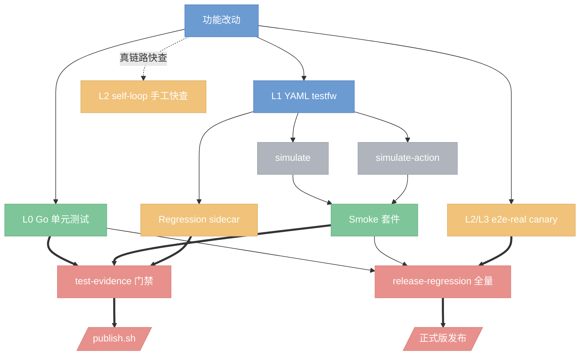
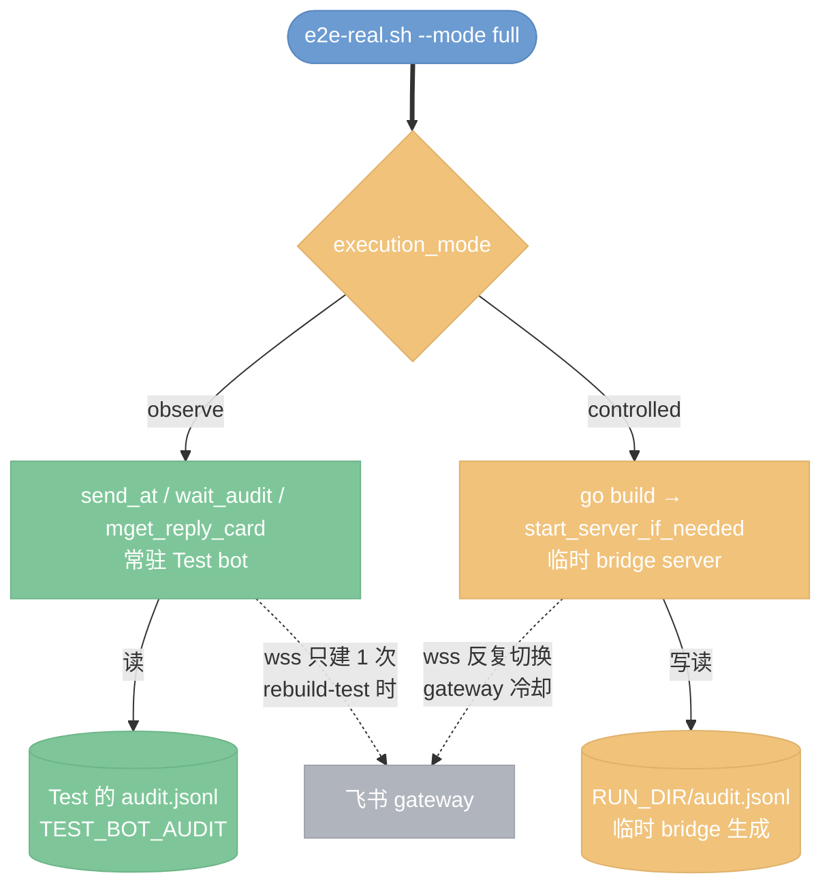

# Bridge 测试框架

本文说明当前 bridge 的测试体系如何组织、每一层的边界与运行方式，以及它与发布门禁的关系。

本文分层编号与 [e2e-coverage-matrix.md](e2e-coverage-matrix.md)、[../plans/2026-07-28-test-framework-overhaul.md](../plans/2026-07-28-test-framework-overhaul.md) 统一为 **L0–L3**。

真实飞书 E2E 的环境准备与操作细节仍以 [testing.md](testing.md) 为准；`scripts/e2e-real.sh` 的用例矩阵见 [e2e-coverage-matrix.md](e2e-coverage-matrix.md)；发布回归 wrapper 见 [regression.md](regression.md)；测试框架的建设方案保留在 [../plans/2026-07-27-comprehensive-test-framework.md](../plans/2026-07-27-comprehensive-test-framework.md)。

## 结论

当前体系分四层，越往下越贵、越接近真实链路。任一改动都从最低层开始向上验证，直到覆盖到风险边界为止：

- **L0 · 单元测试**：`go test ./...` 全仓包内纯逻辑、状态机、渲染契约、协议解析。秒级，合入 + publish 强制门禁。
- **L1 · 组件测试（simulate + fake agent）**：真实 Bridge + fake 依赖。`internal/testfw` 里的 runner + `cmd/lark-agent-bridge simulate`/`simulate-action`，本地 fake AgentRunner 秒级完成，覆盖跨命令行为、prompt 拼装与卡片数据模型，无网络。合入 + publish 强制门禁。
- **L2 · 确定性 e2e（真飞书 + fake agent）**：真飞书 + CardKit + audit + 远端进程 + 重启，用 fake agent 保回复确定性，分钟级。含两种运行形态：`scripts/e2e-real.sh` 自动化（`--mode full`，起独立 bridge server 按用例矩阵批量跑）和 self-loop 手工快查（`rebuild-test.sh` 换血 Test bot 后手工发消息、观察 audit + 回读卡片，适合逐个 bug 快速定验证）。
- **L3 · 真 agent canary**：真 Claude/Codex 的**实际行为**（指令注入遵从、认证、session 续接）。`scripts/e2e-real.sh` 起独立 bridge server（真 App + 真 wss）+ 真 Claude/Codex wrapper 跑，产出 capabilities & summary。正式版发布跑，默认 warn，可 strict。

`scripts/release-regression.sh` 把 L0（`verify.sh`）+ L0 race + L2 e2e-real full（真飞书 + fake Agent）+ L3 canary（真飞书 + 真 Claude）串成一次完整回归；发布凭证 `test-evidence ensure` 单独把 L0 + L1 testfw regression sidecar 作为 publish 的强制门禁。



## L0 — 单元测试

`go test ./...` 覆盖 29 个 package 的纯逻辑、状态机、渲染契约、协议解析。运行时钟秒级。发布凭证阶段用它作为核心门禁。

```bash
env -u E2E_PREFERENCE_STORE -u E2E_REPLY_STORE \
    -u E2E_MEDIA_CACHE_DIR  -u E2E_SESSION_STORE \
    GOCACHE=$PWD/.cache/go-build go test ./...

# 本地快速迭代:跳过 smoke integration
env -u E2E_PREFERENCE_STORE -u E2E_REPLY_STORE \
    -u E2E_MEDIA_CACHE_DIR  -u E2E_SESSION_STORE \
    GOCACHE=$PWD/.cache/go-build go test -short ./...
```

`E2E_*` 清理是必需的：这些环境变量是 supervisor serve 时的 durable state 路径，遗留会让默认路径测试读到生产数据。

`internal/testfw/smoke_suite_test.go::TestSmokeSuite` 把 `tests/smoke/` YAML 套件挂进 `go test ./...`——完整模式会执行、`-short` 会跳过。因此单纯跑 `go test ./...` 就已经同时覆盖了 L0 与 L1 smoke。

## L1 — 组件测试（simulate + fake agent）

框架代码在 `internal/testfw`，可执行入口是 `cmd/lark-bridge-test`。runner 调用 `cmd/lark-agent-bridge simulate` / `simulate-action`，捕获其 JSON 输出的 `events` 与 `audit`，用 YAML 里的 assert 条目断言。**不连接飞书、不启动真 Agent**——fake AgentRunner 会把 `BuildBatchPrompt` 输出 echo 到 `result` event 的 text segment 里（前缀 `simulated answer: `），所以断言本质上是在验证 bridge 的**数据模型 + prompt 拼装**。

**fake claude fixture 引擎**（P-OBSERVE §3.6 Step 6a + Step 6b 完成）：`internal/fakeclaude` 提供 fixture 加载 + 匹配 + emit + `${marker}` 插值 + image side-effect + hang 语义；`cmd/lark-agent-fake-claude` 是独立二进制，`LAB_FAKE_FIXTURE_DIR` 指定 fixture 目录（fail-closed）；fixture 集合 12 例在 `scripts/e2e/fixtures/*.json`，覆盖原 shell shim 全部 10 组 case 分支 + 兜底 fallback。

**L1 与 L2 共享同一份 fixture**：
- L2：`scripts/e2e/lib/server.sh` 的 `prepare_fake_claude_if_needed` 是 4 行 wrapper——`go build` fake claude 二进制到 `FAKE_BIN_DIR/claude` → PATH 前置 → env.sh 注入 `LAB_FAKE_FIXTURE_DIR`。fake 由二进制驱动，server.sh 从 337 行降到 234 行。
- L1：`simulateRunner` 在 `LAB_FAKE_FIXTURE_DIR` 声明且 prompt 命中非-default fixture 时，走 fakeclaude 引擎 → `bridge.ParseClaudeStreamOutput` 解析成 AgentRunResult；未命中 fallback 到原来"simulated answer:"3 段输出（保现有 smoke 零回归）。

一份 fixture 声明 `{match: {marker_pattern|prompt_contains}, emit: [{line, delay_sec}], write_image?, image_name?, hang?, post_delay_sec?}`——`${marker}` 与 `${image_name}` 会按 invocation 现场插值。加一种确定性场景 = 加一份 fixture，不改代码、不改 shim。

用例位于 `tests/smoke/`（6 个）和 `tests/regression/`（17 个）。标签以 OR 语义筛选：`--tags smoke,config` = 带 `smoke` 或 `config` 的用例；`--regression` = `--tags smoke,regression`，跑两类并集。

### 运行入口

```bash
GOCACHE=$PWD/.cache/go-build go run ./cmd/lark-bridge-test --smoke
GOCACHE=$PWD/.cache/go-build go run ./cmd/lark-bridge-test --regression
GOCACHE=$PWD/.cache/go-build go run ./cmd/lark-bridge-test \
    --tags config,session \
    --report-json /tmp/bridge-test-report.json
```

runner 给每个用例一份临时工作目录，把 `E2E_PREFERENCE_STORE` / `E2E_REPLY_STORE` / `E2E_MEDIA_CACHE_DIR` / `E2E_SESSION_STORE` 指向它，用例之间互不污染。

从同一 YAML 生成 L2 手工清单（不执行真实链路，仅投影为 Markdown 表格）：

```bash
GOCACHE=$PWD/.cache/go-build go run ./cmd/lark-bridge-test \
    --regression \
    --emit-l3-checklist /tmp/bridge-l3-checklist.md \
    --checklist-only
```

### 用例格式

一个 YAML 文件 = 一个 `TestCase`。步骤二选一：`input` 走 `simulate`（消息触发），`action` 走 `simulate-action`（卡片按钮触发）。二者并存以 `action` 为准。

```yaml
name: 示例:帮助页与卡片动作
description: 验证消息入口和 action 入口
tags: [smoke, help]
steps:
  - input: /help
    asserts:
      - {type: event_type, expected: help}
      - {type: segment_contains, text: /status}
  - action: help.open_config
    prime_text: /help
    asserts:
      - {type: event_type, expected: config}
      - {type: no_error}
```

**引用消息、群聊、mention、attachment 都可在 YAML 里模拟**：

- `group: true` + `mentioned: false/true` 覆盖群聊未 @ / 已 @ bot 分支。
- `quote_text` / `quote_sender` / `quote_sender_type` 注入被引用消息（内存 fake fetcher，不触发飞书 SDK）。用于验证引用主体身份边框（user / app / self_bot）和用户主指令前置的 prompt 顺序契约。
- `action` 步骤可用 `prime_text` 建会话，`value` / `chat_id` / `open_message_id` / `form_values` / `prime_is_group` / `prime_chat_id` 精确注入卡片上下文。
- `l3.skip: true` + `skip_reason` 显式排除该步骤进入 L2 手工清单——用于 L1 特有依赖分支（如 simulate 未装配 SessionStore/ScheduleStore 的早退路径），必须写明理由。

### 支持的断言

- **`event_type`**：首个 event 的 `Type`。空闲 `/stop` 的 message 类提示可按 `notice` 断言。
- **`segment_contains`**：**Events[0]** 的可见文本包含指定字符串。多帧场景（stream + result）注意 Events[0] 通常是无 segments 的 stream 头帧，此时应改用下一个。
- **`any_segment_contains`**：遍历**全部** event 的可见文本，任一命中即通过。适合断言 prompt / answer / 思考区。
- **`segments_order`**：把全部 event 的可见文本拼成一段，`texts` 里各元素必须**按序**依次出现（允许中间穿插）。倒序或缺段都失败。用于锁死 prompt 拼装顺序契约，例如"用户主指令必须先于引用块"。
- **`header_title`**：首个 event 的 `HeaderTitle` 包含指定字符串。
- **`has_button`**：`Event.Actions[]` 里存在指定 label 的按钮，或 StopButton 可见。**渲染期才生成的表单按钮**（ConfigForm / AgentModeForm）**不能在 L1 中断言**，改用 `event_type` 断言表单类型。
- **`stop_button_visible`** / **`stop_button_disabled`**：验证停止按钮生命周期。
- **`no_events`**：验证消息被正确过滤（如群未 @）。
- **`audit_empty`**：验证无 audit 事件；只有失败/拒绝/排队才写 audit，成功执行不写。
- **`no_error`**：拒绝 `_failed` / `_denied` / `_rejected` audit + `Kind: error` 的卡片片段。`_ignored` / `_unavailable` 不算错误。

### 诚实断言的边界

框架不会把整个 event 序列化为 JSON 兜底断言，也不会按 struct 是否非 nil 硬注入渲染期文案（"全局配置"、"保存" 等）。历史上这两条兜底导致 `/config` 表单卡在 L1 假通过、L2 才发现。现行契约：**断言只作用于真实承载可见文案的字段**——找不到就诚实失败，不糊弄。

## L2 — 确定性 e2e（真飞书 + fake agent）

真飞书 + CardKit + audit + 远端进程 + 重启，用 fake agent 保回复确定性，分钟级。含两种运行形态：**self-loop 手工快查**（`rebuild-test.sh` 换血后手工发消息）和 **e2e-real 自动化**（`scripts/e2e-real.sh --mode full` 批量跑用例矩阵）。

**L2 自动化用例内部分两种 execution_mode**（P-OBSERVE §5.3 观察者模式改造引入）：

- **observe**（10 case）：**对常驻 Test bot 发消息 + 读 Test 的 audit**，不起临时 bridge。消除 wss gateway 反复切换的冷却延迟、临时进程 trap 遗漏成僵尸的类别、`E2E_*` 巨块注入。适合纯观察类：`new_basic` / `streaming_card` / `help` / `status` / `workdir_existing` / `topic_reply_at` / `topic_reply_without_at_negative` / `quote_readback` / `inject_image_intent` / `inject_image_no_intent`。
- **controlled**（33 case，含 preflight utility）：**e2e-real 起自己的临时 bridge**，用于需要 `restart_server` / mutate config / fake claude 定制回复的用例（如 `queue_full`、`session_restart_context`、所有 `media_*` / `config_*` / `reply_*` / `debounce_*`、`inject_schedule_*` 等）。这不是遗留、是架构分工——这些用例本来就想控制被测 bridge 的内部状态。

`register_case` 的第 7 位字段 `execution_mode` 显式声明分类；`run_case` 按此分派。observe 类需 `--environment <name>` 提供常驻 Test 的 audit 路径，未声明时 SKIP 而非 FAIL。完整分类清单见 [../plans/2026-07-28-P-OBSERVE-case-classification.md](../plans/2026-07-28-P-OBSERVE-case-classification.md)。



**environment 声明**（P-OBSERVE §3.4）：`docs/environments/<name>.env` 描述"这台机器上谁扮演什么角色、audit 在哪、L3 sender 是哪个 App"——**结构声明**进 git、不写死 secret。sender App 归属 Linux / Mac **不对称**（Linux sender=Test App，Mac sender=Mike App），是各自 App 权限申请历史造成的；写死进 environment 避免每次现场推理。敏感值仍在 profile（`~/.lark-agent-bridge/e2e/profiles/*.env`，不进 git）。

`make test-l2 ENV=linux-steve` / `make test-l3 ENV=linux-steve` 走 environment；`make deploy-test ENV=linux-steve` 显式换血被测 bot（调 `~/bridge/bridge-self-loop/rebuild-test.sh`）——**故意不在 test-l2 里自动跑**，避免与 self-loop 手工 L3 语义混淆。

### 手工快查形态（self-loop）

适用场景：**改动只涉及 bridge 单点行为**（引用主体识别、prompt 顺序、卡片渲染的时序细节），需要在真实链路下快速验一遍。走 `~/bridge/bridge-self-loop/rebuild-test.sh`：

```bash
bash ~/bridge/bridge-self-loop/rebuild-test.sh ~/bridge/worktrees/<需求 slug>
# 输出 REBUILD_TEST_OK pid=... sha256=...
```

脚本先跑 `l3_sender_preflight`：查 `lark-cli auth status`，硬校验当前 user 身份挂在期望 App 下、scope 含 `im:message.send_as_user`，不满足 fail-closed。然后编译传入的 worktree、停旧 Test、以生产态 env（真 claude wrapper、无 fixture）起新 Test、跑 `doctor --strict`。

之后用飞书能力（`lark-cli im +messages-send` / `+messages-reply` / `+messages-mget` + audit.jsonl）手工发消息 → 观察 audit → 读回复卡。GUIDE.md 里详列了服务器/Mac 各自的 chat_id、Test open_id、audit 位置、mention 规则等。

**关键契约**（引自 self-loop GUIDE.md）：

- **消息由本机 L3 sender 用 `--as user` 身份发**——sender 是**本机具备 `im:message.send_as_user` scope 的那个 App**。两台机器归属反过来：Linux 上 sender = Test App（`cli_fixture_d57513c150e2`），Mac 上 sender = supervisor App。
- **群聊消息必须用动态核验过的 Test open_id @ Test**（`+chat-members-list` 查），不要用 app_id。
- **回读用 `+messages-mget`** 拿真实卡片正文，audit 出现 `cardkit_create` + `cardkit_reply` 即链路通。

### 自动化形态（e2e-real）

适用场景：**发布回归、批量能力覆盖**。`scripts/e2e-real.sh` 起独立 bridge server（真 App、真 wss），批量跑 `case_*` 用例；每个 case 自己发消息、等 audit、读回复、断言。**用 fake Claude（`--mode full`）保回复确定性时属本层（L2）**；换成真 agent 模式则升到 L3（见「L3 — 真 agent canary」）。

用例矩阵分三类：

- **`SMOKE_CASES`**：每次真实冒烟都跑（`new_basic`、`streaming_card`、`help`、`status`、`workdir_existing`、`topic_reply_at`、`topic_reply_without_at_negative` 等）。
- **`FULL_EXTRA_CASES`**：完整回归才跑，含重启、队列、媒体、回收、配置、reply mode、`quote_readback`、`wrapper_preflight` 等（30+ 条）。
- **`FEATURE_CASES`**：必须显式 `--case` 选中的能力验证（如 `group_message_intake`），因为会改变共享 bot 行为。

完整用例矩阵见 [e2e-coverage-matrix.md](e2e-coverage-matrix.md)；新增 case 的 SOP 见 [testing.md](testing.md)「新增回归用例 SOP」。

### profile 与运行

`e2e-real.sh` 通过 `--profile <name>` 索引 `~/.lark-agent-bridge/e2e/profiles/<name>.env`（或 `$STATE_ROOT/.lark-agent-bridge/e2e/profiles/`；`STATE_ROOT` 默认是 repo 根，可用 `E2E_STATE_ROOT` 覆盖）。profile 文件权限必须 `0600`、字段限于白名单：

- `LARK_APP_ID` / `LARK_APP_SECRET`：bridge server 起 wss 用的 App。
- `LARK_BOT_OPEN_ID`：bridge 判 @ 是否命中自己 + `send_at` 构造 `<at user_id=...>` 时用的 bot open_id。
- `E2E_E2E_CHAT_ID`：主测试群。
- `E2E_E2E_LARK_CLI_PROFILE`：`lark-cli --profile <name>` 发消息的身份。
- `E2E_REAL_E2E_P2P_CHAT_ID`（可选）：媒体/P2P case 用。

**这台机器的正确姿势（same-app）**：`LARK_APP_ID` 与 `E2E_E2E_LARK_CLI_PROFILE` 都指向 Test App。preflight 的 `oauth_same_app` 契约就是要求"bridge 与 sender 同 App"。**误解为要"两个不同 App"是历史踩坑**——只有 Mac Mike 那种"supervisor 是 sender、Test 是 bot"的天然对称才是双 App 模式；Linux 上没这个对称条件，走 same-app 才对。

**同 bot 在不同 App 视角下 open_id 不同**：Test bot 从 Steve/Mac Mike 视角看是 `ou_3c0a...`，从 Test App 自己视角看是 `ou_d84156fe...`。e2e-real profile 的 `LARK_BOT_OPEN_ID` 必须与 `E2E_E2E_LARK_CLI_PROFILE` 的 App 视角一致——用错视角会让所有消息的 `mention.id` 变成 `app_id`，bridge 的 `mentionsIncludeBot` 匹配不上，全被 `group_message_skipped(mention_required)` 掉。用 `lark-cli --profile <sender> im +chat-members-list <chat>` 动态核验。

### 运行入口

```bash
# 先停 Test 让出 App wss(same-app 下 Test 与 e2e-real bridge 争同一条连接)
kill -TERM "$(cat ~/.cache/lark-bridge-test/service.pid)"

# preflight only:静态检查 profile / scope / group 可读
E2E_STATE_ROOT="$HOME" ./scripts/e2e-real.sh --profile <name> --preflight-only

# 单 case
E2E_STATE_ROOT="$HOME" ./scripts/e2e-real.sh --profile <name> --case new_basic

# 完整回归(真飞书 + fake Claude,可加 --strict-capabilities 让 BLOCKED 立即失败)
E2E_STATE_ROOT="$HOME" ./scripts/e2e-real.sh --profile <name> --mode full --strict-capabilities

# 跑完恢复 Test
bash ~/bridge/bridge-self-loop/rebuild-test.sh ~/bridge/lark-ai-agent-bridge
```

每次运行产出结构化 summary：`~/.cache/e2e/<profile>/real-<run_id>/`，含 `summary.md`、`capabilities.json`、`audit.jsonl`、各 case 的 log 与 mget 卡片。

### capabilities 语义

preflight 会评估一组 capabilities（`credentials` / `oauth_same_app` / `lark_cli_auth` / `bot_identity` / `test_group` / `p2p_chat` / `wrapper` / `exclusive_runtime` / `card_action` / `media_image` / `media_file` / `recall_event_delivery` / …）。每个 capability 有 `PASS` / `BLOCKED` / `FAIL` / `SKIPPED` 四态。`BLOCKED` 表明外部前置缺失（如 P2P chat 未配置），`FAIL` 表明 canary 真的失败了。`--strict-capabilities` 让任何 `BLOCKED` 都视作硬失败。

## L3 — 真 agent canary

适用场景：**正式版发布前验证真 Claude/Codex 的实际行为**——指令注入遵从、认证、session 续接等只有真 agent 能暴露的问题（fake agent 天然验不到）。它复用 L2 的 e2e-real 编排（同一 `scripts/e2e-real.sh`、同一 profile 与 capability 机制），区别只在**关闭 fake agent、放真 Claude/Codex 进链路**：

```bash
# 真 agent canary:去掉 fake Claude 注入,让真 Claude 实际执行
env -u E2E_REAL_E2E_FAKE_CLAUDE \
    ./scripts/e2e-real.sh --profile <name> --case new_basic
```

同一 case 在 L2 用 fake agent 跑「Bridge 管线」（收到 markdown → 上传飞书等确定性链路），在 L3 用真 agent 跑「指令遵从」（真的照注入指令行事）。两层职责分开：**L2 证明管线通，L3 证明指令真的改变了 AI 行为**。

L3 默认 **warn-only**——真 agent 输出天然有波动，断言只锁指令要求的关键行为特征，不锁自然语言细节。经 `release-regression.sh` 的 `--strict-l3` 可转硬 gate。它只在正式版发布跑，不进 publish 强制门禁。

## release-regression.sh — 全量回归编排

`scripts/release-regression.sh --profile <name>` 把上面各层串起来，作为发正式版前的完整回归：

1. **L0 + L1**：`REQUIRE_LARK=1 ./scripts/verify.sh`——文档契约 + `go test ./...`（L0）+ doctor + 命令面 simulate + smoke 套件 + 会话行为 + 卡片/长连接 action（L1）等。
2. **L0 race**：`go test -race ./internal/{schedule,session,bridge,card}`——重点 package 的并发正确性。
3. **L2**：`./scripts/e2e-real.sh --profile <name> --mode full --strict-capabilities`——真飞书 + fake Claude 完整能力矩阵。
4. **L3**：`env -u E2E_REAL_E2E_FAKE_CLAUDE ./scripts/e2e-real.sh --profile <name> --case new_basic`——真 Claude canary，默认 warn-only。加 `--strict-l3` 转硬 gate。

顶层输出 `RELEASE_REGRESSION_OK release=<ver> l0l1=passed l2=passed l3=<passed|warn>`。任一硬 gate 失败即非 0 退出。

**它不是 publish.sh 的强制门禁**——publish 只要求 `test-evidence`（下一节）。`release-regression.sh` 是转正式版前的额外保护网。

## 发布凭证 test-evidence 与 publish 门禁

`cmd/lark-bridge-release test-evidence ensure` 是 publish 的**强制门禁**，被 `publish.sh` 与 `release-bridge.sh` 自动调用：

- 在隔离环境跑完整 `go test ./...`。
- 随后跑 `lark-bridge-test --tags regression --report-json <sidecar>`，产出原子写入的 JSON sidecar。
- 记录 sidecar 的路径和 SHA-256、绑定 commit/tree、Go binary SHA、`go env` 关键项。
- 只接受 `all_passed: true`。哈希不匹配、sidecar 缺失、`all_passed=false` 都会让凭证失效，publish 拒绝执行。

这使 publish 自动覆盖 L0 + L1 smoke integration + regression 三层，无需人工干预。**publish 不自动覆盖 L2/L3**——由 self-loop 手工快查或 `release-regression.sh` 的 e2e-real（L2 fake agent + L3 真 agent canary）另行执行。

## 分层原则（P-CASES §4.6）

新加 case 必须依次通过**两条 PR 门禁**，写不清就下沉一层：

1. **前置调研门禁**：先证明**没有等价的已存在测试**。命令：`grep -rn <断言核心> --include="*_test.go" internal/`；若已有等价覆盖，**纳入目录索引**（挂到 `e2e-coverage-matrix.md` 相应能力组，不新加代码）。**这条是 P-CASES Phase 1 血泪教训**——v2 plan 里 7 个"新增"L0/L1 case 实际上全部已有测试，未审查就动手会重复劳动。

2. **分层下沉门禁**：证明**为什么不能在 L0 或 L1 覆盖**。判定顺序 L0→L1→L3：
   - **L0（`go test`）** —— 断言是**纯函数或纯数据结构变换**（`buildXxx` 返回值、parser 输出、序列化/反序列化、prompt 组装、mention 剥离）。**不涉及**：进程管理、外部 IO、时序。
   - **L1（testfw YAML / simulate + fake claude）** —— 断言涉及**bridge 内部状态机的可观察输出**（command dispatch 类型、session 生命周期切换、卡片 event 结构、audit 记录），且这些输出可以在**进程内 simulate** 就能触发和读取。**不涉及**：真飞书 SDK 时序、真 action callback 往返、真 agent 行为、真群消息 intake。
   - **L3（真飞书 + 真 Claude/Codex）** —— 只有以下三类之一才落 L3：
     - **真 SDK 时序依赖**：cardkit_reply 落地顺序、message reaction 生命周期、message recall event 时序等，simulate 无法真实复现
     - **真 action callback 往返**：需要飞书 gateway 转发的 card action（stop 按钮、resume 选择、config.save 表单）——**注意**：`e2e-coverage-matrix.md` 域 3 已确认此路径由飞书平台限制无法自动化，`card.action.trigger` 的真实用户点击目前只能靠 UI automation 手动测
     - **真 agent 行为**：验证 bridge instructions 注入后真 Claude/Codex 是否遵从（图片意图、schedule 走 propose 路径）

两条门禁都过了才准落 L3。若发现只是"想在真链路验一下同样的逻辑"，说明门禁 2 没过，应该下沉。

**扩展：** 详细论证见 [P-CASES plan §4.6](../plans/2026-07-28-test-framework-overhaul-P-CASES.md#46-分层原则约束未来-case-该落哪一层)。

## 新增或修改用例

1. **先跑分层门禁**（上一节 §分层原则）。确定 case 该落 L0/L1/L3，若已有等价测试则改为"纳入目录索引"而非新增。
2. **在 L3 加 case 时**（`scripts/e2e/registry.sh` 的 `register_case`）：必须显式声明 `capability` 字段（`main_link|commands|config|lifecycle|queue|group|media|recovery|render|reply_mode|internal` 之一）；空值或未知值会让 `bash scripts/e2e/run.sh --list-cases` 直接报错。命名统一 snake_case，格式 `<capability-prefix>_<action>_<state>`（如 `revoke_during_queue`、`session_resume_after_restart`）。
3. **smoke vs regression**：核心、高频、发布前必须秒级发现的入 `tests/smoke/` 带 `smoke` tag；广覆盖、边界、管理命令入 `tests/regression/` 带 `regression` tag。别只靠目录名，runner 以 tag 为准。
4. **顺序契约用 `segments_order`**，不要串起多条 `any_segment_contains` 来暗示顺序——那样倒序也会通过。
5. **卡片按钮**优先用 `action` 步骤，并为相同权限与输入契约的动作保持 `/action <id>` 消息等价入口。只在卡片上下文专有字段时才用 action 注入。
6. **写完 e2e-real case 必须**：加进 `scripts/e2e/registry.sh` 声明 `register_case ... <capability>`；使用 `prereq_base` 复用现有 capability 名，无额外需求走默认分支；`needs_callback=1` 只给需要 callback gateway 的 case；跑 `bash scripts/e2e/run.sh --profile <name> --case <name> --strict-capabilities` 单验；跑 `bash scripts/e2e/run.sh --capability <name> --list-cases` 确认能力组归属正确。完整 SOP 见 [testing.md](testing.md)。
7. **变更收口**：跑 `go test ./...`（含 smoke integration）；涉及发布证据的另跑 regression；涉及真链路的按 self-loop GUIDE 决定 L2/L3。

## 已知限制

- **L1 断言的是 bridge 产生的卡片数据模型**，不是飞书最终渲染后的 UI。表单提交按钮、卡片样式细节等渲染期元素必须靠 L2/L3。
- **simulate 未装配全部 store**：目前只装了 Preference、DevMode、Workspaces。Updates、Schedules、Access 仍未装配——相关 YAML 只能断言当前可观察行为，不能虚构本地模拟没有的状态。用 `l3.skip` 显式排除并留原因。
- **L2 手工清单只投影消息型 `input` 步骤**，跳过 `action` 步骤——它不证明真实的 `card.action.trigger` 投递。带 `form_values` 的动作需另行执行真实卡片点击验收。
- **release-regression.sh L2/L3 需要独占同 App 的 wss**：跑之前必须停 supervisor 或 Test。同一 App 建两条 wss 会话，飞书 gateway 不保证投递到哪一条，audit 会不稳定。
- **`scripts/lib/simulate-suite.sh:21` 的 SessionID 断言已修**：原断言 `chat-demo:message:` 与真实输出（带 `thread:@bot:local-...` 段）不符，已放宽为稳定前缀 `"claude:chat-demo:`。
- **命令面套件的 store 污染已修**：`smoke-local.sh` / `verify.sh` 的 `smoke_command_surface` / `smoke_group_intake` 曾因 simulate 的 durable store 落到调用者实时 workspace（supervisor `~/ws/.../.lark-agent-bridge/`）而读到生产 preferences override，导致 `all_group_messages` 用例假失败（读到 supervisor 的 `participated_topics`）——`all_group_messages` 功能本身正常，问题是测试隔离。已在 `scripts/lib/assert.sh` 的 `simulate()` 里统一注入套件级临时 `E2E_PREFERENCE_STORE` 隔离（调用方显式设的 store 仍优先）。修复后 `make smoke-local` / `make verify` 命令面套件在 HEAD 上全绿（此前从未绿过）。

## 相关代码

**testfw runner**：

- `cmd/lark-bridge-test/main.go`：CLI 参数、用例加载、report/checklist 输出。
- `internal/testfw/types.go`：YAML 与 simulate JSON 的契约（含 `Segment` / `Assert.Texts`）。
- `internal/testfw/runner.go`：隔离运行器、标签筛选、CLI 调用、报告。
- `internal/testfw/assert.go`：10 种断言的语义与可见文本抽取（`extractVisibleText`）。
- `internal/testfw/smoke_suite_test.go`：smoke 挂进 `go test` 的连接点。
- `internal/testfw/report.go` / `checklist.go`：发布 sidecar 与 L2 手工清单投影。

**fake claude fixture 引擎**（P-OBSERVE §3.6 Step 6a）：

- `internal/fakeclaude/fixture.go`：Fixture / Match / Emit 类型、LoadDir、NewInvocation、Resolve、Default、ValidateInstruction。
- `internal/fakeclaude/fixture_test.go`：12 个单测锁 parser + matcher + loader + Default fallback + ValidateInstruction 语义。
- `cmd/lark-agent-fake-claude/main.go`：独立二进制入口，`LAB_FAKE_FIXTURE_DIR` 强制显式，兼容 `FAKE_CLAUDE_LOG` + 指令泄漏 exit 92 语义。
- `scripts/e2e/fixtures/*.json`：4 个示例 fixture + README（含 Step 6b 待迁清单）。

**e2e-real observer mode**（P-OBSERVE §3.2-§3.5）：

- `scripts/e2e/registry.sh`：`E2E_CASE_EXECUTION_MODE` 关联数组 + `case_execution_mode` / `any_selected_case_is_controlled` helper。
- `scripts/e2e/run.sh`：`--environment <name>` flag、`OBSERVE_AUDIT` 全局、`run_case` 按 execution_mode 分派、主序列条件门禁跳过 `go build`。
- `docs/environments/{linux-steve,macos-mike}.env`：environment 声明，进 git、不含 secret。
- `docs/plans/2026-07-28-P-OBSERVE-case-classification.md`：44 case 分类清单（10 observe / 33 controlled + preflight）+ 疑点。

**发布门禁**：

- `cmd/lark-bridge-release/evidence.go`：`test-evidence ensure`，publish 门禁核心。

**顶层脚本**：

- `scripts/verify.sh`：L0/L1 结构化 verify（文档契约 + go test + doctor + smoke + 会话/卡片/回收）。
- `scripts/release-regression.sh`：L0→L3 全量编排。
- `scripts/e2e-real.sh`：真飞书 + 真/假 Agent 的 case-based canary，含 preflight capabilities。
- `scripts/lib/e2e-profile.sh`：profile 加载与安全字段/权限校验。
- `scripts/lib/simulate-suite.sh` / `scripts/lib/assert.sh`：命令面 simulate 断言集。

**self-loop（L2 手工快查）**：

- `~/bridge/bridge-self-loop/rebuild-test.sh` (Linux) / `rebuild-test-macos.sh` (Mac)：Test bot 换血 + `l3_sender_preflight` 硬校验。
- `~/bridge/bridge-self-loop/GUIDE.md`：手工验证步骤、chat_id / open_id / audit 位置、发布收口协议。
